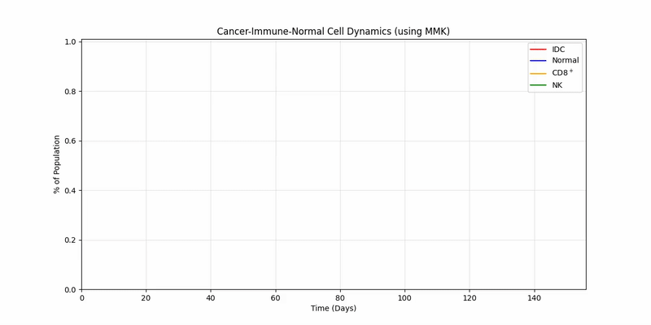

This repo contains the work of Óscar J. Escobar, Joseph Humpherys, Henry Fetzer, and Clifton Langley.
Our project, for our modeling with dynamics class, was to find an optimal control of the AC treatment for IDC.

# Modeling the State using Michaelis-Menten Kinectics
This is an animation of our system dynamics over time.
This incorporates tumor lysis and cell recruitment.

